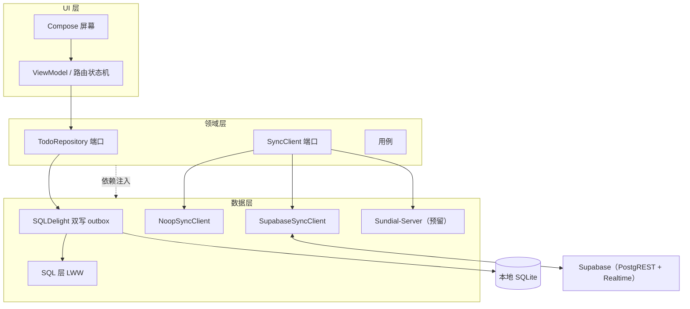

<p align="center">
  
</p>

<h1 align="center">Sundial</h1>

<p align="center">
  <strong>跨平台待办应用</strong> · 本地优先 · 实时多端同步
</p>

<p align="center">
  <a href="https://opensource.org/licenses/Apache-2.0">
    
  </a>
  
  
  
  
</p>

---

## 简介

Sundial 是使用 **Kotlin Compose Multiplatform** 实现的全平台同步 Reminder App——一套代码同时覆盖 Android、iOS 与桌面（macOS / Windows / Linux）。

它采用**本地优先**架构——所有数据先落本地 SQLite，同步作为可插拔的后端能力存在：默认纯本地使用，需要时一键切换到 Supabase 云端，实现多设备实时同步；未来还可接入自建服务器（已预留端口）。

## 功能特性

- **智能列表**：今天 / 计划 / 全部 / 已完成 / 垃圾箱，一目了然
- **自定义列表**：七种主题色，无限分组
- **子任务**：任意层级嵌套，展开 / 收起
- **完整编辑能力**：标题、备注、到期时间、旗标、移动列表、软删除
- **自然语言日期输入**：输入「明天」「下周一 15:00」「后天中午」等即可解析（中文支持）
- **多端实时同步**：Supabase PostgREST + Realtime，行级 LWW 冲突解决，断网自动重试
- **离线优先**：本地 outbox 记录所有变更，重连后自动补推
- **深色 / 浅色主题**，像素级一致的三端体验

## 技术栈

| 层 | 技术 |
| --- | --- |
| UI | Compose Multiplatform（共享 UI） |
| 架构 | 分层架构 + Arrow `Either` 类型化错误处理 |
| 数据库 | SQLDelight（SQLite），本地优先 |
| 同步 | supabase-kt（PostgREST + Realtime），`SyncClient` 端口可插拔 |
| 日期 | kotlinx-datetime |
| 依赖注入 | 手写 `AppGraph` 懒加载图（无框架） |

## 架构



同步核心设计：

- 每次本地写入在**同一事务内**更新数据行并追加一条 outbox 记录（完整行 JSON 快照）
- `SyncCoordinator` 批量推送 outbox，按 `seq` 水位线清理——不丢、不重
- 远端变更通过 **SQL 层 LWW**（`updated_at` 大者胜）应用，自身设备回声自动过滤
- `SyncClient` 端口是未来的 seam：新增自建服务器只需实现一个适配器，其余代码零改动

详见 [ADR 0002：多端同步架构决策](docs/adr/0002-sync-backend.md)。

## 快速开始

### 环境要求

- JDK 17+
- Android Studio（Android / iOS 构建）
- Xcode（iOS 构建）

### 运行桌面版

```bash
./gradlew :desktopApp:run
```

### 构建 Android

```bash
./gradlew :androidApp:assembleDebug
```

### 运行测试

```bash
./gradlew :shared:desktopTest :androidApp:assembleDebug
```

### 启用 Supabase 多端同步

1. 在 [Supabase](https://supabase.com) 创建项目
2. 在 SQL Editor 执行 [docs/sync-setup.md](docs/sync-setup.md) 中的初始化脚本
3. 应用内「设置 → Supabase 云端」填入项目 URL 与 anon key，保存即可

> ⚠️ 当前为无登录模型，RLS 对 anon 全开，仅适合个人自用。安全边界详见 [docs/sync-setup.md](docs/sync-setup.md)。

## 项目结构

```
shared/                      共享代码（UI + 领域 + 数据）
  src/commonMain/kotlin/
    com/myapplication/shared/
      domain/                领域模型、仓库端口、同步端口、用例
      data/                  仓库实现、SQLDelight、同步适配器与引擎
      ui/                    Compose 屏幕、组件、主题、ViewModel
      util/                  日期解析与格式化
  src/commonMain/sqldelight/ SQLDelight schema 与迁移
  src/{android,desktop,ios}Main/  平台驱动与入口
desktopApp/                  桌面应用入口
androidApp/                   Android 应用入口
docs/                        架构决策（ADR）、Supabase 配置指南、Logo
TODO.md                      已知问题与待办
```

## 文档

- [ADR 0001：Arrow 类型化错误处理](docs/adr/0001-arrow-functional-core.md)
- [ADR 0002：多端同步架构决策](docs/adr/0002-sync-backend.md)
- [Supabase 同步配置指南](docs/sync-setup.md)
- [已知问题与 Roadmap](TODO.md)

## 已知限制

- 行级 LWW 在双端同时编辑同一行时可能丢更新（个人使用可接受）
- 无墓碑机制：晚到的旧写入可能复活已删除的行
- 同步仅增量（outbox 推送 + 实时订阅），无全量重拉

## License

[Apache License 2.0](LICENSE.txt)

Copyright © 2026 Somhairle H. Marisol
