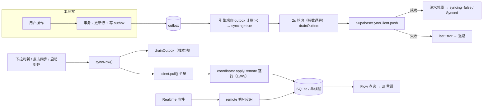

# 同步体验与移动端交互完善 — 设计规格（Spec）

> 日期：2026-08-12 · 状态：已评审（待实现）· 对应计划：`docs/superpowers/plans/2026-08-12-sync-ux-and-polish-plan.md`

## 1. 背景与目标

用户反馈的三大问题与诉求：

1. **同步时完全不可用 / 一边改了另一边没有反馈**：桌面端同步线程与 UI 线程并发访问 SQLite（SQLDelight JDBC 驱动非线程安全，事务经 `ThreadLocal` 绑定、无内部锁，`Transacter.Transaction.endTransaction` 为 final 方法绕过任何驱动级包装）→ 间歇性 `database is locked`、静默失败。另无拉取路径，Realtime 事件一旦丢失（离线期、订阅失败）数据永久不同步。
2. **移动端需要下拉刷新**：带精美动效，下拉拉取云端最新数据刷新待办。
3. **双端同步动画指示**：操作待办后，同步状态应有动画指示「正在将数据同步到云端」。

同时覆盖 `TODO.md` 全部条目：Drawer 化移动端详情（A）、同步体验五项优化（B）、Bug 1–5。

## 2. 非目标（本期不做）

- CRDT / 墓碑 / 字段级合并（维持 LWW 语义，见 ADR 0002）
- 同步 `since` 水位线增量拉取（本期全量拉取，个人数据量可承受；接口预留）
- 服务端 Quarantine 机制（客户端隔离即可）
- 宽屏详情栏改造（保持现状）
- 多用户 / 认证

## 3. 核心设计决策（已调研验证）

| # | 决策 | 依据 |
|---|------|------|
| D1 | **单线程 DB 收敛**：所有 SQLDelight 访问（含 Flow 查询）收敛到一条专用线程（`newSingleThreadContext`），替代驱动级同步包装 | `JdbcDriver` 非线程安全；`Transacter.Transaction.endTransaction$runtime` 为 final，驱动包装无法拦截提交 → 包装方案不完整；单线程收敛是 SQLDelight 官方推荐模式 |
| D2 | **`SyncClient.pull()` 全量拉取**：无参（无水位线），拉取两张表全部行，经 LWW 应用；数据量小、幂等 | postgrest-kt 3.7.0 `select { filter { gt(...) } }` 返回 `PostgrestResult.data: String`；全量最简单且正确 |
| D3 | **Realtime 真实连接状态接入**：`Realtime.getStatus(): StateFlow<Realtime.Status{DISCONNECTED,CONNECTING,CONNECTED}>` 存在（已 javap 验证），重加 `SyncClient.observeConnectionStatus()` 端口方法 | 替代「push 成功才置 connected」的代理信号 |
| D4 | **引入 material3 1.9.0**（CMP 1.11.1 官方映射，已存在于依赖缓存）：下拉刷新用 `PullToRefreshBox`，抽屉用 `ModalNavigationDrawer` | `androidx.compose.material3.pulltorefresh` 包已在 material3 1.9.0 构件中验证存在 |
| D5 | **`SyncStatus` 增 `syncing: Boolean`**（末尾默认 false，向后兼容全部既有构造点）；UI 侧派生相位而非新增枚举 | 相位 = f(syncing, connected, lastError, mode)，见 §5 |
| D6 | **失败行隔离**：`pushUpserts` 逐行校验，坏行跳过并计入错误，不再整批失败 | Bug 5 |
| D7 | **首次启用自动对齐**：`configure` 成功后自动触发一次 `syncNow()`（全量拉取即对齐，覆盖 TODO B-5） | 无增量水位线时最简 |

## 4. 数据流



## 5. 同步状态机（UI 相位派生）

```
SyncStatus(mode, connected, pendingCount, lastSyncAt, lastError, syncing)

phase(status) =
  mode == Local            → 本地（灰）
  syncing                  → 同步中（品牌橙，旋转动画）
  lastError != null        → 错误（红）
  connected                → 已同步（绿，静态对勾）
  else                     → 未连接（橙/灰）
```

- `syncing` 置真的时机：① outbox 观察器发现待同步 >0（用户操作后**即时**反馈，无需等 2s 轮询）；② `syncNow()` 发起时；③ 轮询 tick 发现积压时。
- `syncing` 置假的时机：drain 成功且 pendingCount==0；drain/pull 失败（转 Error）；configure 切换。

## 6. 动画规格

| 场景 | 动画 |
|------|------|
| 同步中指示器（侧边栏/设置页/顶栏） | `Sync` 图标（双箭头）以 900ms/圈线性旋转，`rememberInfiniteTransition` + `graphicsLayer.rotationZ` |
| 下拉刷新 | material3 `PullToRefreshBox` 标准指示器（旋转箭头 + 收缩/释放反馈），`isRefreshing = status.syncing`，`onRefresh = engine.syncNow()` |
| 抽屉详情（移动端） | `ModalNavigationDrawer`：遮罩淡入 + 内容水平滑出 300ms 标准缓动；关闭=遮罩点击/返回键 |
| 已同步完成 | 指示器从旋转态切换为静态对勾（相位切换动画 200ms 淡入） |

## 7. 移动端抽屉式详情（TODO A）

- 窄屏分支（`App.kt` `else` 主列表分支）用 `ModalNavigationDrawer` 包裹；`drawerState` 由 `selectedId != null` 驱动（`open()`/`close()`），抽屉内容 = 现 `DetailScreen`。
- 返回键：`PlatformBackHandler` 保持 `route != Route.Main` 时 `mainVm.back()`（关抽屉语义 = route 置 Main）。
- `remember(currentId)` 重建语义保持（进入抽屉时重建，关闭后丢弃）。
- 宽屏不变。遮罩点击关闭：`drawerState.close()` + `mainVm.back()` 同步。
- 键盘适配：DetailScreen 现有 `imePadding` 行为保留。

## 8. Bug 修复规格（TODO.md 1–5）

| # | 修复 |
|---|------|
| 1 | `bucketOf`：周日桶边界改为基于「距今天的日差 ≤ 本周剩余天数」的统一公式：`daysUntilNextWeekday` 语义重写（见计划 Task 9 代码） |
| 2 | `formatDueDate`：跨周判定改为「距今天 ≤7 天 且 目标星期几 ≠ 今天」即显示「周X」（排除今天与明天已占用的档位） |
| 3 | `DateParser`：`上午12点 → 0点`；`中午N点 → N==12 ? 12 : N+12`（13~23 点） |
| 4 | `AddTodo`/`AddSubTask`：父任务查询加 `is_trashed = 0` 过滤（新增 `selectByIdActive` 查询），校验失败返回既有错误通道 |
| 5 | `pushUpserts` 坏行跳过（D6），`push` 返回 `Either<SyncError, Int>`（成功行数）语义不变 |

## 9. 验收标准

1. 桌面端连续操作 + 同步同时进行 5 分钟无 `database is locked`、无卡死；双端互改 10 条数据全部到达（Realtime + 手动同步双通道）。
2. 操作待办后 ≤200ms 内同步指示器开始旋转；完成后转对勾；失败转错误态并显示 lastError。
3. 移动端列表下拉出现刷新指示器动画；松手后触发 `syncNow()`；远端改动出现在列表中（含另一设备新增/编辑/删除）。
4. 移动端点开待办以抽屉动画呈现；返回键/遮罩点击关闭；键盘不遮挡编辑区。
5. Bug 1–4 的边界用例测试通过（周日桶、跨周周X、上午12点/中午N点、软删除父任务）。
6. `./gradlew :shared:desktopTest --rerun-tasks :androidApp:assembleDebug` 全绿（存量 74 + 新增）。

## 10. 前置检查（用户侧，非代码任务）

- Supabase 项目表结构必须与 `docs/sync-setup.md` 一致（`reminder_list` 蛇形列名；此前错误 URL 中出现 `reminderlist`/`colorkey`，为表结构不匹配或旧 APK 证据——若仍不符，一切同步功能不生效）。
- 移动端重新安装（旧 APK 无 INTERNET 权限/旧代码）。

## 11. 遗留（本期明确不做，记入 TODO）

- pull 增量水位线（`since` 参数预留）
- 服务端 Quarantine
- Realtime 事件丢失的补偿窗口（依赖 pull 兜底）
